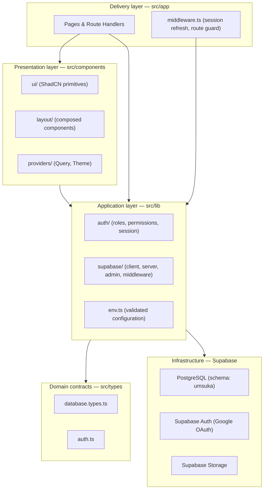
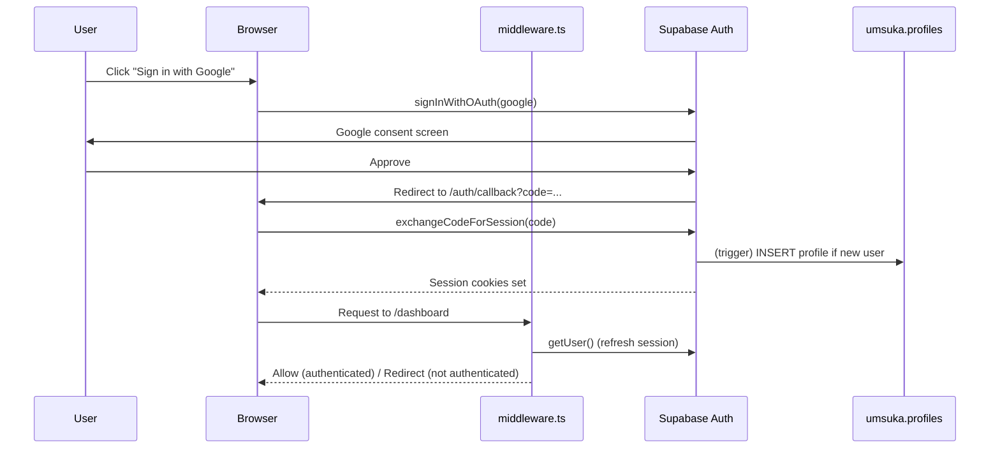
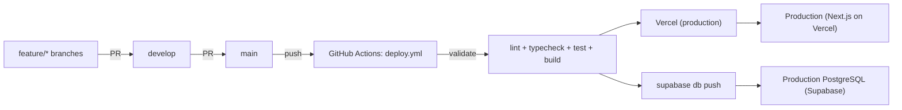

# Architecture

## Overview

UMSUKA Imbali App follows a layered, Clean-Architecture-inspired structure on
top of the Next.js 15 App Router. Business modules (Events, Attendance,
Shifts, News, Questions, Voting, Documents, Administration) are added inside
this same structure — none of them change these boundaries.

## Boundary rules

1. **`src/app`** owns routing, layout composition and request/response
   concerns only. It must not contain SQL, RLS assumptions, or business
   rules beyond simple redirects/guards.
2. **`src/components`** is presentation-only. Server data fetching happens
   in Server Components/Server Actions; client components receive data as
   props or fetch through TanStack Query hooks that call Server Actions or
   Route Handlers.
3. **`src/lib`** is the application layer: Supabase client factories, auth
   session/role resolution, environment validation, and (as modules are
   added) use-case functions per domain (e.g. `lib/events/`,
   `lib/attendance/`). Each module's business logic belongs here, not in
   components or routes.
4. **`src/types`** holds domain contracts, kept framework-agnostic.
5. **`supabase/migrations`** is the single source of truth for schema
   changes. No table is ever created directly through the Studio UI in a
   way that isn't captured in a migration.

## Authentication & authorization flow

Authorization is enforced in three independent layers (defense in depth):

1. **Middleware** — redirects unauthenticated users away from protected
   routes. Convenience/UX only; never trusted for data access.
2. **Server validation** — Server Actions and Route Handlers re-check the
   session and role via `getCurrentProfile()` / `requireAdmin()` /
   `requireManagement()` before performing any mutation.
3. **Supabase RLS** — the last line of defense, enforced by PostgreSQL
   itself regardless of what the application layer does or fails to do.

## Deployment topology

