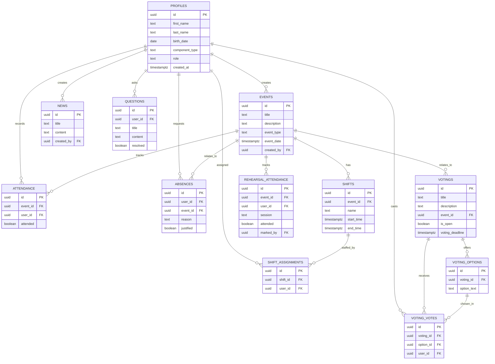

# Database

All business data lives in the PostgreSQL schema **`umsuka`** (never
`public`). Authentication identities remain in Supabase's built-in
`auth.users`, referenced by foreign key from `umsuka.profiles.id`.

## Entity-relationship diagram

## Migrations

| File | Purpose |
|---|---|
| `20260101000000_init_schema.sql` | Creates the `umsuka` schema, grants, `pgcrypto` extension |
| `20260101000100_profiles.sql` | `umsuka.profiles` |
| `20260101000200_events.sql` | `umsuka.events` |
| `20260101000300_shifts.sql` | `umsuka.shifts` |
| `20260101000400_shift_assignments.sql` | `umsuka.shift_assignments` |
| `20260101000500_attendance.sql` | `umsuka.attendance` |
| `20260101000600_absences.sql` | `umsuka.absences` |
| `20260101000700_news.sql` | `umsuka.news` |
| `20260101000800_questions.sql` | `umsuka.questions` |
| `20260101000900_votings.sql` | `umsuka.votings` |
| `20260101001000_voting_options.sql` | `umsuka.voting_options` |
| `20260101001100_voting_votes.sql` | `umsuka.voting_votes` |
| `20260101001200_auth_trigger.sql` | Additive `component_type` default + `handle_new_user()` trigger |
| `20260101001300_rls_policies.sql` | Helper functions + RLS policies for every table |
| `20260101004000_shift_assignment_groups.sql` | `shift_assignments.confirmed`/`created_by`, `events.visible_to_group`/`created_by_workgroup`, RLS de eventos y asignaciones por grupo |
| `20260101004100_component_type_requires_workgroup.sql` | `profiles` CHECK: music/dance requieren workgroup; `create_emailless_profile` con validación explícita |
| `20260101004200_member_detail_lead_reads.sql` | Políticas SELECT aditivas en `shift_assignments` y `attendance` para que un workgroup lead lea turnos/asistencia de los miembros de su propio grupo (Sprint 14) |
| `20260101004300_component_lead_for.sql` | `profiles.component_lead_for` (TEXT, CHECK music/dance, índice único parcial: un responsable por componente), función `umsuka.is_component_lead(text)` y políticas SELECT aditivas en `shift_assignments`/`attendance` para responsables de componente (Sprint 14) |
| `20260101004900_votings_enhancement.sql` | `votings.voting_deadline` (ficha límite opcional), índice único case-insensitive en `voting_options` (`voting_id, lower(option_text)`), función `umsuka.get_voting_results(uuid)` (SECURITY DEFINER: recuentos y porcentajes por opción, ocultos hasta votar/cerrar salvo management) y política INSERT de `voting_votes` endurecida (la opción debe pertenecer a la misma votación) — Sprint 15 |
| `20260101005700_rehearsal_event_type.sql` | `ALTER TYPE umsuka.event_type ADD VALUE 'rehearsal'` (migración separada por la restricción de PostgreSQL sobre `ADD VALUE`) — Sprint 27 |
| `20260101005800_rehearsal_attendance.sql` | `events.morning_session`/`afternoon_session` + CHECKs coherentes, ENUM `umsuka.rehearsal_session` (`morning`/`afternoon`), tabla `umsuka.rehearsal_attendance` (UNIQUE `event_id,user_id,session`, FKs con ON DELETE CASCADE, `marked_by`), trigger `updated_at`, índices y RLS — Sprint 27 |
| `20260101006000_workgroup_stats_average.sql` | Función SECURITY DEFINER `umsuka.my_workgroup_shift_average()` (media de asistencia por miembro del workgroup del actor; REVOKE public/anon + GRANT authenticated) — Sprint 28 |

Apply locally with `npm run supabase:reset`; apply to a remote project with
`supabase db push` (also run automatically by `deploy.yml` on merge to `main`).

## Schema-impacting decision log

> **Only two changes were made beyond the literal source-of-truth DDL, both
> additive and backwards-compatible:**

1. **`umsuka.profiles.component_type` gained `DEFAULT 'member'`.**
   The column remains `NOT NULL` with its original `CHECK` constraint
   unchanged. This was required so `umsuka.handle_new_user()` (the trigger
   that auto-creates a profile on first Google sign-in) has a valid value
   to insert before the member has chosen their actual component. No
   existing row is affected; the value can still be changed by the member
   or an admin at any time.
2. **Indexes added on every foreign-key column.** PostgreSQL does not
   auto-index foreign keys; without these, joins and RLS `using` clauses
   that filter by `user_id`/`event_id`/etc. would degrade to sequential
   scans as tables grow.

No table structure, column, type, or constraint from the official schema
was altered or removed.

## Row Level Security

RLS is **enabled and forced** on every `umsuka` table — there is no table
that a client can query without a matching policy. Two `SECURITY DEFINER`
helper functions avoid recursive-RLS problems when checking the caller's
role from within `umsuka.profiles` itself:

- `umsuka.current_user_role()` — returns the caller's role or `null`.
- `umsuka.is_admin()` — `true` for `super_admin`/`admin`.
- `umsuka.is_management()` — `true` for `super_admin`/`admin`/`board_member`/`event_manager`.
- `umsuka.is_workgroup_lead(check_workgroup text)` — `true` when the caller leads the given workgroup.
- `umsuka.is_component_lead(check_component text)` — `true` when the caller is the responsable of the given component (`music`/`dance`); used by the Sprint 14 additive SELECT policies on `shift_assignments`/`attendance`.
- `umsuka.get_voting_results(p_voting_id uuid)` — SECURITY DEFINER, `stable`, read-only: per-option vote counts and percentages (one decimal). Returns an empty set while the voting is effectively open AND the caller has not voted AND the caller is not management; granted only to `authenticated` (Sprint 15).

Baseline policy shape (tightened per-module as each is implemented, never
loosened):

| Table | Select | Insert / Update / Delete |
|---|---|---|
| `profiles` | any authenticated user | update: owner or admin · delete: admin · insert: trigger only |
| `events` | any authenticated user, **or restricted to `visible_to_group` members; management always** | management roles only · plus workgroup leads for their own `work_shift` events |
| `shifts`, `news`, `votings`, `voting_options` | any authenticated user | management roles only |
| `shift_assignments` | owner or management (plus leads of the shift's event, plus workgroup leads for members of their own workgroup via `shift_assignments_select_lead_workgroup`, plus component leads for members of their own component via `shift_assignments_select_component_lead` — Sprint 14) | management roles only · plus leads for shifts on their own `work_shift` events matching their group |
| `attendance` | owner or management (plus workgroup leads for members of their own workgroup via `attendance_select_lead_workgroup`, plus component leads for members of their own component via `attendance_select_component_lead` — Sprint 14) | management roles only |
| `absences` | owner or management | insert: owner · update/delete: management |
| `questions` | any authenticated user | insert: owner · update: owner or management · delete: management |
| `voting_votes` | owner or management | insert: owner — opción de la misma votación (`exists` sobre `voting_options`, Sprint 15) · immutable (no update policy) · delete: management |
| `rehearsal_attendance` | owner or management | insert/update (`upsert` por `event_id,user_id,session`) y delete: management only — Sprint 27 |

## Extensibility

The following tables are pre-approved for future migrations when their
modules are implemented, and must follow the same pattern (indexes,
constraints, RLS, 3NF): `umsuka.documents`, `umsuka.document_categories`,
`umsuka.notifications`, `umsuka.settings`, `umsuka.audit_logs`,
`umsuka.event_registrations`, `umsuka.event_comments`,
`umsuka.push_subscriptions`, `umsuka.role_permissions`.
